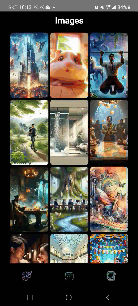
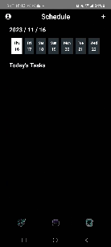
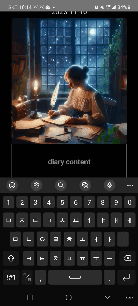
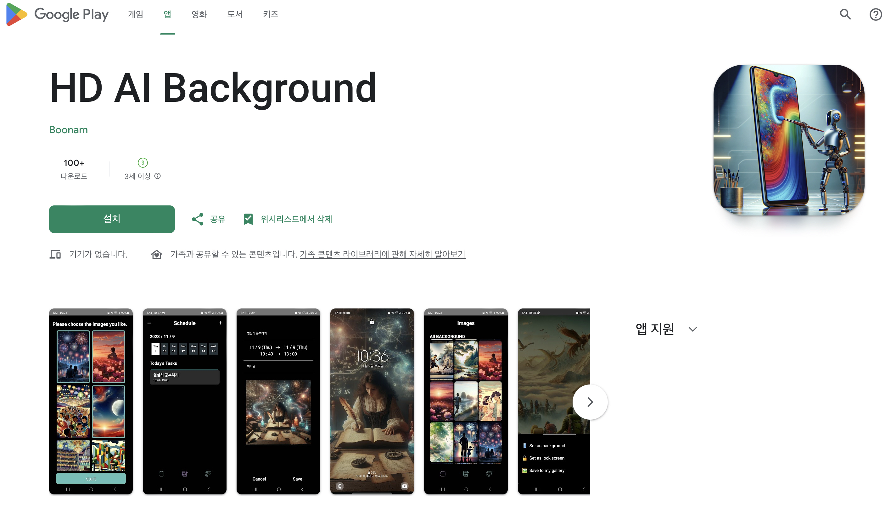

| 목차 |                     내용 |
| :--- | -----------------------: |
| 1    |           [개요](##개요) |
| 2    | [기능 설명](##기능-설명) |
| 3    | [기능 시연](##기능-시연) |
| 4    | [팀원 소개](##팀원-소개) |

> ## 개요

### 🖐 SSAFY 9기 자율 프로젝트 🖐

<b>일정 맞춤 배경화면 생성 어플</b>

> ## 기능 설명

1. 사용자가 입력한 일정(텍스트)을 기반으로 AI를 활용하여 이미지를 생성하고 배경화면을 변경합니다.

2. 이미지 생성 시 사용자가 선호하는 그림체와 유사한 이미지를 생성합니다.

3. 하루 동안 있었던 일들을 일기로 작성하여 하루를 요약하는 이미지를 생성합니다.

> ## 기능 시연

|                     초기 로딩화면                      |                      테마 선택                       |                     배경화면 리스트                      |
| :----------------------------------------------------: | :--------------------------------------------------: | :------------------------------------------------------: |
|   |      |  |
|                      스케줄 생성                       |                   다이어리 페이지                    |                                                          |
|  |  |                                                          |

> ## 팀원 소개

| [박태흠(팀장)](https://github.com/TaeHeumPark) | [김두현](https://github.com/Duhyeon2Kim) |  [박기택](https://github.com/taekto)   |               [이대건](https://github.com/leedaegeon)                | [조영헌](https://github.com/marine-doe) |  [김영인](https://github.com/poiu542)  |
| :--------------------------------------------: | :--------------------------------------: | :------------------------------------: | :------------------------------------------------------------------: | :-------------------------------------: | :------------------------------------: |
|          |    |  |  |   |  |
|                 Android PM                  |                 Android                  |                Android                 |                            Backend AI                             |              Backend AI              |            Backend Infra            |

## 구글 플레이스토어 배포

[구글플레이스토어 바로가기](https://play.google.com/store/apps/details?id=io.b101.picashow&pli=1)

현재는 서비스하지 않습니다.
